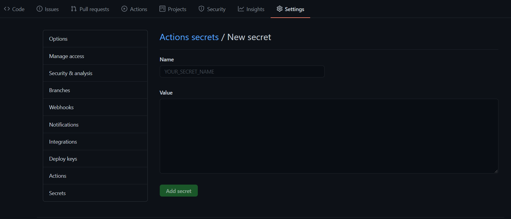
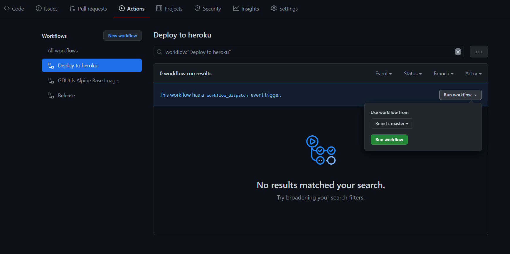
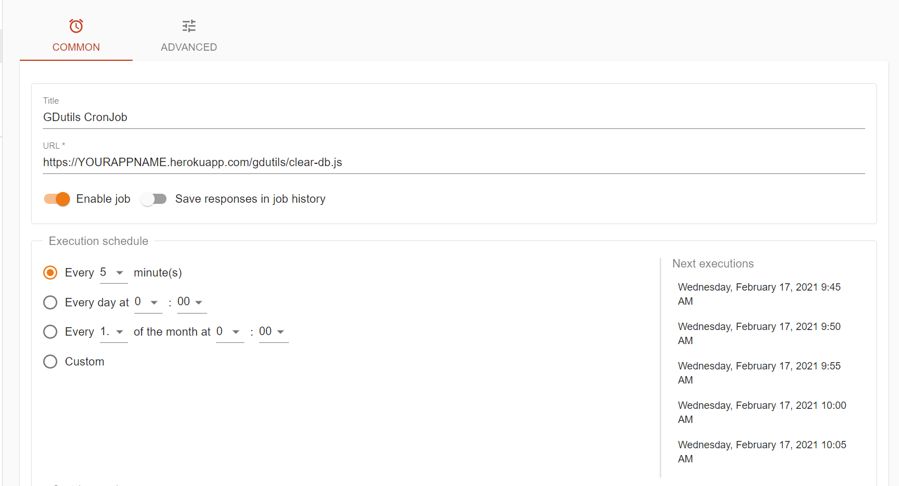
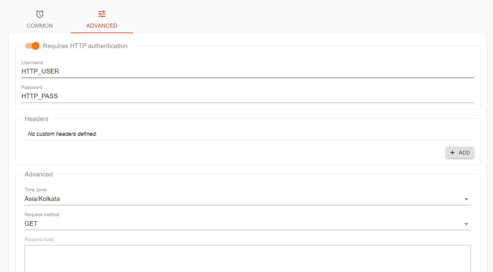

<div align="center">
<h1>GDUtils Terminal + Bot</h1>
<h3>Gd-Utils is just another Tool which helps us to Bypass the 750GB daily limit by Google</h3>
<h3>🌟 This repo is just for Docker/Heroku deployment of GDUtils 🌟</h3>
</div>

> Do not overuse it, or your account might be banned by Heroku.

> Old Deployments Needs to be updated as new Builds are based on Alpine

### Pre Requisites
1️⃣ [Github Account](https://github.com)

2️⃣ [Heroku Account](https://heroku.com)

3️⃣ [Telegram Account](https://telegram.org)

4️⃣ [Some Patience](https://www.google.com/search?q=how+to+be+more+patient)

### Deployment

🔷 Here I Don't Provide any Deploy button to heroku, We Use Github Actions to Deploy container to Heroku 

#### Steps

1. Fork this Repo
2. Go to Repository `Settings` -> `Secrets`
    
    
3. Now set the below Variables in the Github Repository Secrets
    [Environmental Variables](#environmental-variables)

4. After Setting this go to Actions and Run the Workflow
   
   

5. Now Go to the App URL and Press the link shown Below
   
   

6. Now it Opens the Web Terminal
   
   

7. Setting WebHook for Bot Mode
 
    🔷 By Default Script will set the Webhook

    🔷 if the Bot didn't respond Just type `SetWebhook`

    ```
    > bash-4.4$ SetWebhook
    {"ok":true,"result":true,"description":"Webhook is already set"}
    ```
8. Done You Bot is Now Live and You can use the terminal Even if you want and Can generate Snap2HTML and Tree
   
   🔷 To access your files in your working directory go to (Avoid Using name index.html for Both Snap2HTML and Tree)
    
    ```
    https://YOURAPP.herokuapp.com/out/
    ```

### Usage
 - **Web Terminal**
  
      Just type `gdutils` in Web Terminal
      ```
      bash-5.0$ gdutils
      GD-UTILS by iwestlin, English version by Roshanconnor, Polished by Nenokkadine
      1.Copy Files to your Teamdrive
      ➖➖➖➖➖➖➖➖➖➖➖➖➖➖➖➖➖➖➖➖➖➖➖➖
      2.Calculate Size
      ➖➖➖➖➖➖➖➖➖➖➖➖➖➖➖➖➖➖➖➖➖➖➖➖
      3.Remove Duplicate Files
      ➖➖➖➖➖➖➖➖➖➖➖➖➖➖➖➖➖➖➖➖➖➖➖➖
      4.EXIT

      Choose any Number [1-4]:

      ```

 - **Telegram Bot** 
      
      Just Type `/help` in Telegram Bot

### Environmental Variables

| Variable | Value | Example | Required | Description |
| :---: | :---: | :---: | :---: | :---: |
| HEROKU_EMAIL | Heroku email | abc@abc.com | True | Just Give the email you used for Heroku Account|
| HEROKU_API_KEY | Heroku API key | xxxxxxx-xxxx-xxxx-xxxx-xxxxxx | True | Get it from [Heroku](https://dashboard.heroku.com/account/applications/authorizations/new) |
| REGION | Heroku Container Region | EU | False | Needed only if you need an EU Container |
| HEROKU_APP | Heroku app name | Name Must be unique | True | Heroku app name that needs to be Updated or Created (Should be in lowercase) |
| SA_ZIP | Direct Link | https://abc.com/sa.zip | False* | Service accounts to be zipped in a way that there should be a folder named accounts containing SA Jsons |
| GH_REPO | SA repo name | accounts | False** | Git repo name where SA's are Uploaded |
| GH_USER | Github Username | Nenokkadine | False** | Github username Where SA are uploaded |
| GH_AUTH_TOKEN | Github Auth Token | xxxxxxxxxxxxxx | False** | Get this from [Github](https://github.com/settings/tokens/new) With Scopes `repo` |
| BOT_TOKEN | Telegram Bot Token | 123456:abcdef | True | Get this from [Telegram](https://t.me/botfather) |
| AUTH_CHATS | Authorized Chats | 'UserA','UserB' | True | Telegram Username's/User ID's Should be Given and Should be in Single Quotes |
| HTTP_USER | Username | user | False | HTTP Basic auth adds an Extra Layer security for your app (recommended) |
| HTTP_PASS | Password | pass | False | HTTP Basic auth adds an Extra Layer security for your app (recommended) |

### How to make the App Never Sleep?
1. Setup a [CronJob](https://console.cron-job.org) to Make the heroku app never sleep
   - First Sign-up in the above Site
   - Then Go [here](https://console.cron-job.org/jobs/create), and Follow the ScreenShot below
        
        ```
        URL:
        https://YOURAPPNAME.herokuapp.com/gdutils/check.js
        ```
        
   - If you have Setup Basic HTTP Auth you should fill these too
        
         
   - Now you can save and enable the cron job, and your app never Sleeps again.

2. Use [Kaffeine](https://kaffeine.herokuapp.com/) and Just give the app name, App's With Basic HTTP Auth enabled Might not work here

### Note 

* No Need to redeploy if new changes are made to src folder, it will built and your apps will fetch the latest release

* if Docker Base image is updated then you should redeploy (Not gonna happen Soon).
 
### Credits
👏 [iwestlin](https://github.com/iwestlin) - The original Developer of this tool

👏 [Roshan](https://github.com/roshanconnor123) - Translated Entire repo into English and the bash Script

👏 [Shuanglei Tao](https://github.com/tsl0922) - Developer of TTYD (Terminal over Web)

## License
[MIT](https://choosealicense.com/licenses/mit/)
